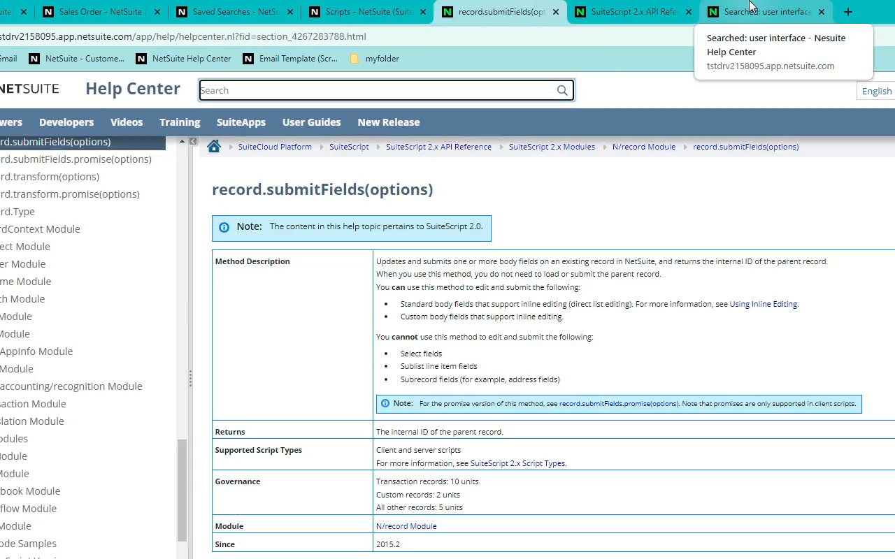

# Netsuite Help Center Titles
An extremely lightweight extension that implements minor but significative changes that enhace the user experience of working with the NetSuite Help Center in the browser.
It puts the title of whatever you have opened in the NS Help Center (including search queries), in the title of the tab it is in. To not confuse the Help Center tabs with other NS tabs, it also changes the icon.
This allows us to profit of having many tabs opened, comfortably.

## Usage screenshots
 
